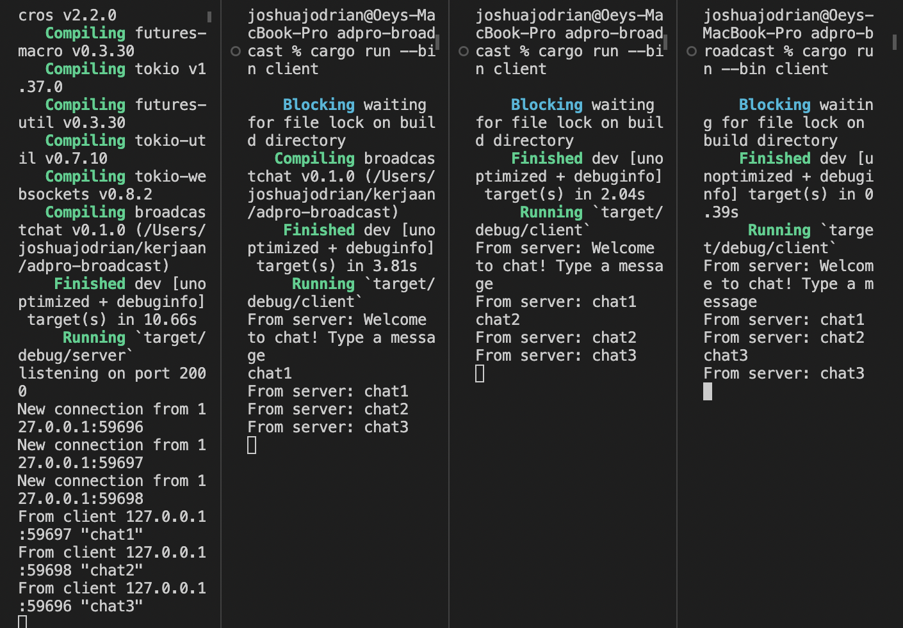
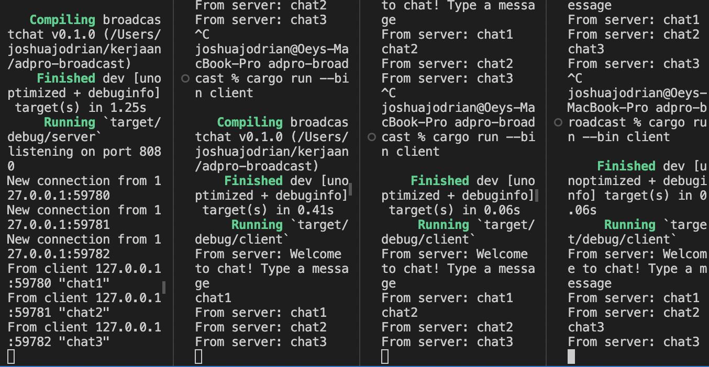
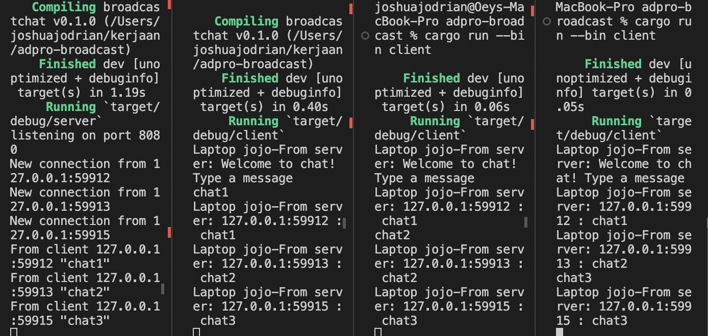

### 2.1. Original code of broadcast chat

Run menggunakan
`cargo run --bin server` untuk server dan
`cargo run --bin client` untuk masing-masing client.
Tiap client dan tiap server mendapatkan chat broadcast dari tiap clientnya. Tiap kali suatu client mengirim pesan, pesan dikirimkan ke server, yang memforwardnya ke semua client yang terhubung.

### 2.2.

Jika kedua port di server dan client diganti, tetap akan berhasil asalkan portnya sama. Jika port berbeda akan gagal. 

di client didefinisikan pada

`ClientBuilder::from_uri(Uri::from_static("ws://127.0.0.1:8080")).connect().await?;`

di server pada

`let listener = TcpListener::bind("127.0.0.1:8080").await?;`

### 2.3

Ditambahkan informasi IP dan port pada masing-masing message sebelum pesan ditampilka dengan mengubah bcast_tx